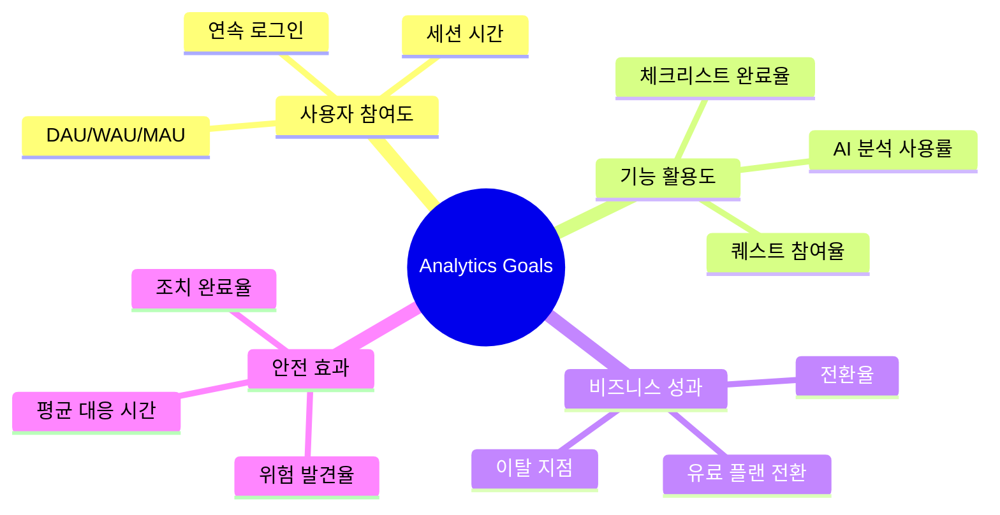
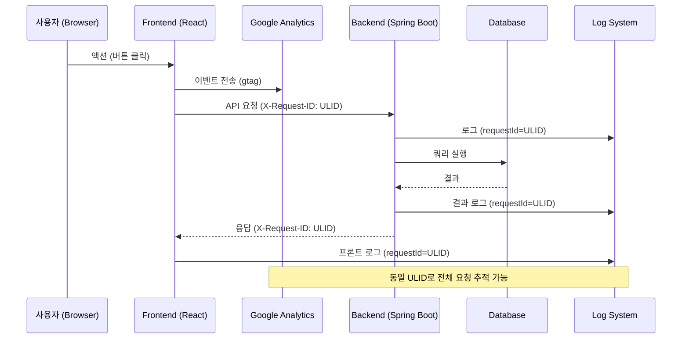

# 🔍 Safety Quest 프로젝트 Google Analytics 통합 가이드

> **목적**: 산업 안전 관리 게이미피케이션 플랫폼의 사용자 행동 분석을 위한  
> Google Analytics 4 (GA4) 및 로깅 기반 모니터링 전략 가이드

---

## 📋 목차

1. [프로젝트 개요 및 분석 목표](#1-프로젝트-개요-및-분석-목표)
2. [GA4 기초 설정](#2-ga4-기초-설정)
3. [핵심 트래킹 포인트 설계](#3-핵심-트래킹-포인트-설계)
4. [프론트엔드 이벤트 추적](#4-프론트엔드-이벤트-추적)
5. [백엔드 로그 기반 분석](#5-백엔드-로그-기반-분석)
6. [전구간 추적 (E2E Tracing)](#6-전구간-추적-e2e-tracing)
7. [핵심 인사이트 및 KPI](#7-핵심-인사이트-및-kpi)
8. [구현 우선순위](#8-구현-우선순위)

---

## 1. 프로젝트 개요 및 분석 목표

### 1.1 서비스 특성

| 구분 | 내용 |
|------|------|
| **Frontend** | React SPA (Life-game/safety-quest-game) |
| **Backend** | Spring Boot 3.x (safert-road-inclass) |
| **핵심 기능** | 안전 체크리스트, AI 위험 분석, 게이미피케이션 |
| **타겟 사용자** | 기술인, 관리감독자, 안전관리자 |

### 1.2 분석 목표



---

## 2. GA4 기초 설정

### 2.1 첫걸음: GA4 계정 생성

1. **Google Analytics 접속**: [analytics.google.com](https://analytics.google.com)
2. **속성 생성**: "Safety Quest Game" 이름으로 웹 속성 생성
3. **데이터 스트림 설정**: 웹 스트림 추가 (프론트엔드 URL)
4. **측정 ID 획득**: `G-XXXXXXXXXX` 형식의 ID 복사

### 2.2 React에 GA4 설치

```bash
# 프론트엔드 프로젝트에서 설치
cd Life-game/safety-quest-game
npm install react-ga4
```

### 2.3 초기화 코드 (권장 위치: `src/main.jsx`)

```javascript
import ReactGA from 'react-ga4';

// 환경변수에서 측정 ID 로드
const GA_MEASUREMENT_ID = import.meta.env.VITE_GA_MEASUREMENT_ID;

if (GA_MEASUREMENT_ID && import.meta.env.PROD) {
  ReactGA.initialize(GA_MEASUREMENT_ID, {
    gaOptions: {
      // 사용자 개인정보 보호
      anonymize_ip: true,
      send_page_view: false  // 수동 페이지뷰 제어
    }
  });
}
```

---

## 3. 핵심 트래킹 포인트 설계

### 3.1 프론트엔드 페이지별 분석 포인트

현재 프로젝트의 **13개 페이지**를 분석한 결과입니다:

| 페이지 | 파일 | 핵심 추적 이벤트 | 우선순위 |
|--------|------|------------------|----------|
| **LandingPage** | `LandingPage.jsx` | CTA 클릭, 스크롤 깊이, 시작 버튼 | 🔴 높음 |
| **LaunchScreen** | `LaunchScreen.jsx` | 역할 선택 | 🔴 높음 |
| **Dashboard** | `Dashboard.jsx` | 출석 체크, 퀘스트 시작, 아바타 클릭 | 🔴 높음 |
| **RiskSolutionPage** | `RiskSolutionPage.jsx` | AI 분석 요청, 분석 완료, 조치 저장 | 🔴 높음 |
| **Signup** | `Signup.jsx` | 회원가입 시작/완료, 플랜 선택 | 🔴 높음 |
| **Shop** | `Shop.jsx` | 아이템 조회, 구매, 장착 | 🟡 중간 |
| **Inventory** | `Inventory.jsx` | 아이템 장착/해제, 세트 효과 확인 | 🟡 중간 |
| **Profile** | `Profile.jsx` | 설정 변경, 통계 조회 | 🟢 낮음 |
| **Daily/Weekly/MonthlyQuests** | Quest pages | 퀘스트 완료, 보상 수령 | 🟡 중간 |

### 3.2 백엔드 API 컨트롤러별 분석 포인트

**7개 컨트롤러**에서 추출한 핵심 추적 지점:

| 컨트롤러 | 엔드포인트 | 핵심 로그 이벤트 | 비즈니스 인사이트 |
|----------|-----------|------------------|-------------------|
| **AuthController** | `/api/v1/auth/*` | 로그인/회원가입/토큰갱신 | 인증 성공률, 세션 유지 |
| **AiController** | `/api/v1/ai/analyze` | AI 분석 요청/응답 시간 | AI 기능 의존도, 성능 |
| **ChecklistController** | `/api/v1/checklists/*` | 생성/제출/승인 | 체크리스트 완료율 |
| **RiskController** | `/api/v1/risks/*` | 위험 평가/조치 완료 | 위험 관리 효율성 |
| **ReviewController** | `/api/v1/reviews/*` | 리뷰 요청/승인 | 승인 워크플로우 효율 |
| **TemplateController** | `/api/v1/templates/*` | 템플릿 조회/사용 | 템플릿 활용도 |

---

## 4. 프론트엔드 이벤트 추적

### 4.1 핵심 커스텀 이벤트 정의

```javascript
// src/utils/analytics.js - 분석 유틸리티 생성

import ReactGA from 'react-ga4';

/**
 * 안전 퀘스트 게임 전용 분석 유틸리티
 */
export const analytics = {
  // 페이지뷰 추적
  pageView: (pagePath, pageTitle) => {
    ReactGA.send({ hitType: 'pageview', page: pagePath, title: pageTitle });
  },

  // 사용자 참여 이벤트
  engagement: {
    dailyCheckIn: (consecutiveDays, bonusPoints) => {
      ReactGA.event({
        category: 'Engagement',
        action: 'daily_check_in',
        label: `streak_${consecutiveDays}`,
        value: bonusPoints
      });
    },
    
    questComplete: (questId, questType, pointsEarned) => {
      ReactGA.event({
        category: 'Quest',
        action: 'quest_complete',
        label: `${questType}_${questId}`,
        value: pointsEarned
      });
    }
  },

  // AI 분석 기능 이벤트
  aiAnalysis: {
    start: (inputLength) => {
      ReactGA.event({
        category: 'AI',
        action: 'analysis_start',
        label: 'risk_analysis',
        value: inputLength
      });
    },
    
    complete: (riskLevel, processingTimeMs) => {
      ReactGA.event({
        category: 'AI',
        action: 'analysis_complete',
        label: riskLevel,  // LOW, MEDIUM, HIGH, CRITICAL
        value: processingTimeMs
      });
    },
    
    savedAction: (riskLevel) => {
      ReactGA.event({
        category: 'AI',
        action: 'action_saved',
        label: riskLevel
      });
    }
  },

  // 전환 이벤트
  conversion: {
    signupStart: () => {
      ReactGA.event({ category: 'Conversion', action: 'signup_start' });
    },
    
    signupComplete: (planType) => {
      ReactGA.event({
        category: 'Conversion',
        action: 'signup_complete',
        label: planType  // free, pro, enterprise
      });
    },
    
    planSelected: (planType, price) => {
      ReactGA.event({
        category: 'Conversion',
        action: 'plan_selected',
        label: planType,
        value: price
      });
    }
  },

  // 상점 이벤트
  shop: {
    itemView: (itemId, itemName, category) => {
      ReactGA.event({
        category: 'Shop',
        action: 'item_view',
        label: `${category}_${itemName}`
      });
    },
    
    itemPurchase: (itemId, itemName, price) => {
      ReactGA.event({
        category: 'Shop',
        action: 'item_purchase',
        label: itemName,
        value: price
      });
    }
  }
};
```

### 4.2 적용 예시: RiskSolutionPage

현재 `RiskSolutionPage.jsx`에 분석 추가 예시:

```javascript
// RiskSolutionPage.jsx 수정 예시
import { analytics } from '../utils/analytics';

const handleSubmit = async () => {
    const textToSubmit = inputText.trim() || DEFAULT_RISK_TEXT;
    const startTime = Date.now();
    
    // ✅ AI 분석 시작 이벤트
    analytics.aiAnalysis.start(textToSubmit.length);
    
    setStep('analyzing');
    
    try {
        const result = await geminiService.analyzeRisk(textToSubmit);
        
        // ✅ AI 분석 완료 이벤트
        analytics.aiAnalysis.complete(
            result.riskLevel,
            Date.now() - startTime
        );
        
        setAnalysisResult(result);
        setStep('result');
    } catch (err) {
        // ✅ 에러 추적
        ReactGA.event({
            category: 'Error',
            action: 'ai_analysis_error',
            label: err.message
        });
        setError(err.message);
    }
};

const handleSaveAndClose = () => {
    // ✅ 조치 저장 이벤트
    analytics.aiAnalysis.savedAction(analysisResult.riskLevel);
    navigate('/');
};
```

### 4.3 적용 예시: Dashboard 출석 체크

```javascript
// Dashboard.jsx 수정 예시
import { analytics } from '../utils/analytics';

// StreakButton onCheckIn 콜백에 추가
onCheckIn={() => {
    const result = checkAttendance(userProfile.getName() || 'guest');
    if (result.success) {
        // ✅ 출석 체크 이벤트
        analytics.engagement.dailyCheckIn(
            result.consecutiveDays,
            result.bonus
        );
        // 기존 로직...
    }
}}
```

---

## 5. 백엔드 로그 기반 분석

### 5.1 구조화된 로그 형식 (JSON)

Spring Boot에 JSON 로그 형식을 적용하면 로그 분석 도구(ELK, Cloud Logging 등)와 연동이 용이합니다.

```yaml
# application.yml
logging:
  pattern:
    console: '{"timestamp":"%d{ISO8601}","level":"%level","logger":"%logger","requestId":"%X{requestId}","message":"%msg"}%n'
```

### 5.2 핵심 비즈니스 로그 포인트

```java
// RiskController.java - 비즈니스 로그 강화 예시
@PostMapping("/{checklistItemId}/assess")
public ApiResponse<RiskAssessmentResponse> assessRisk(...) {
    
    // 📊 비즈니스 메트릭 로그
    log.info("METRIC:RISK_ASSESS requestId={} itemId={} frequency={} severity={} userId={}", 
             MDC.get("requestId"),
             checklistItemId, 
             request.getFrequency(), 
             request.getSeverity(),
             currentUser.getId());
    
    RiskAssessmentResponse response = riskService.assess(checklistItemId, request, currentUser);
    
    // 📊 결과 메트릭 로그
    log.info("METRIC:RISK_ASSESSED requestId={} itemId={} riskLevel={} score={}", 
             MDC.get("requestId"),
             checklistItemId,
             response.getRiskLevel(),
             response.getRiskScore());
    
    return ApiResponse.success(response);
}
```

### 5.3 API 응답 시간 측정

```java
// RequestLoggingFilter.java 또는 Interceptor
@Component
public class MetricsFilter extends OncePerRequestFilter {
    
    @Override
    protected void doFilterInternal(HttpServletRequest request, 
                                    HttpServletResponse response, 
                                    FilterChain chain) {
        long startTime = System.currentTimeMillis();
        String requestId = request.getHeader("X-Request-ID");
        
        MDC.put("requestId", requestId);
        
        try {
            chain.doFilter(request, response);
        } finally {
            long duration = System.currentTimeMillis() - startTime;
            
            // 📊 API 성능 메트릭
            log.info("METRIC:API_CALL requestId={} method={} path={} status={} durationMs={}", 
                     requestId,
                     request.getMethod(),
                     request.getRequestURI(),
                     response.getStatus(),
                     duration);
            
            MDC.clear();
        }
    }
}
```

---

## 6. 전구간 추적 (E2E Tracing)

### 6.1 현재 구현 상태

프로젝트에 이미 **X-Request-ID 기반 추적**이 구현되어 있습니다:

```javascript
// apiClient.js - 이미 구현됨 ✅
const getDefaultHeaders = () => {
    const headers = {
        'Content-Type': 'application/json',
        'X-Request-ID': getSessionRequestId(),  // ULID 기반 세션 ID
    };
    // ...
};
```

### 6.2 추적 흐름도



### 6.3 통합 로그 검색 예시

```bash
# 특정 요청의 전체 흐름 검색 (ELK/Cloud Logging)
requestId:"01HWQXYZ1234567890ABCDEF"

# 프론트엔드 + 백엔드 로그가 모두 검색됨
```

---

## 7. 핵심 인사이트 및 KPI

### 7.1 안전 서비스 특화 KPI

| 카테고리 | KPI | 계산 방법 | 목표값 |
|----------|-----|-----------|--------|
| **사용자 참여** | DAU (일간 활성 사용자) | 고유 사용자 수 / 일 | - |
| | 7일 리텐션 | D7 재방문 / D0 신규 | > 30% |
| | 평균 연속 로그인 | streak.current 평균 | > 5일 |
| **기능 활용** | AI 분석 사용률 | AI 요청 / 총 세션 | > 40% |
| | 체크리스트 완료율 | 완료 / 생성 | > 80% |
| | 퀘스트 참여율 | 일일 퀘스트 완료 / DAU | > 60% |
| **안전 효과** | 위험 발견율 | 발견된 위험 / 점검 수 | 측정 후 개선 |
| | 조치 완료율 | 완료 조치 / 발견 위험 | > 90% |
| | 평균 대응 시간 | 발견→조치 시간 차 | < 24시간 |
| **비즈니스** | 가입 전환율 | 가입 완료 / 랜딩 방문 | > 5% |
| | 유료 전환율 | 유료 가입 / 전체 가입 | > 10% |

### 7.2 GA4 대시보드 구성 권장

```
📊 Safety Quest Analytics Dashboard
├── 📈 실시간 현황
│   ├── 현재 활성 사용자
│   ├── 진행 중인 AI 분석
│   └── 오늘의 퀘스트 완료 수
├── 👥 사용자 행동
│   ├── 사용자 흐름 (Landing → Signup → Dashboard)
│   ├── 페이지별 체류 시간
│   └── 이탈 페이지 분석
├── 🎯 전환 퍼널
│   ├── Landing CTA 클릭률
│   ├── 회원가입 단계별 이탈
│   └── 플랜 선택 분포
└── 🔧 기능 사용
    ├── AI 분석 요청 추이
    ├── 위험 레벨별 분포
    └── 조치 완료 추이
```

---

## 8. 구현 우선순위

### Phase 1: 기초 설정 (1-2일)

- [ ] GA4 계정/속성 생성
- [ ] React에 `react-ga4` 설치 및 초기화
- [ ] 기본 페이지뷰 자동 추적 설정

### Phase 2: 핵심 이벤트 (3-5일)

- [ ] `analytics.js` 유틸리티 생성
- [ ] **LandingPage**: CTA 클릭, 스크롤 깊이
- [ ] **Signup**: 가입 시작/완료, 플랜 선택
- [ ] **Dashboard**: 출석 체크, 퀘스트 시작
- [ ] **RiskSolutionPage**: AI 분석 시작/완료/저장

### Phase 3: 백엔드 로그 강화 (3-5일)

- [ ] JSON 로그 포맷 적용
- [ ] 비즈니스 메트릭 로그 추가 (`METRIC:` 프리픽스)
- [ ] API 응답 시간 로그 필터 구현

### Phase 4: 대시보드 구성 (2-3일)

- [ ] GA4 커스텀 리포트 생성
- [ ] 핵심 KPI 대시보드 구성
- [ ] 알림 설정 (이상 징후 감지)

---

## 📚 참고 자료

- [Google Analytics 4 공식 문서](https://developers.google.com/analytics/devguides/collection/ga4)
- [react-ga4 라이브러리](https://www.npmjs.com/package/react-ga4)
- [Spring Boot Structured Logging](https://docs.spring.io/spring-boot/docs/current/reference/html/features.html#features.logging)
- [OpenTelemetry (고급 분산 추적)](https://opentelemetry.io/)

---

> 💡 **다음 단계**: 이 가이드를 바탕으로 Phase 1부터 순차적으로 구현을 진행하세요.  
> 추가 질문이 있으시면 말씀해 주세요!
