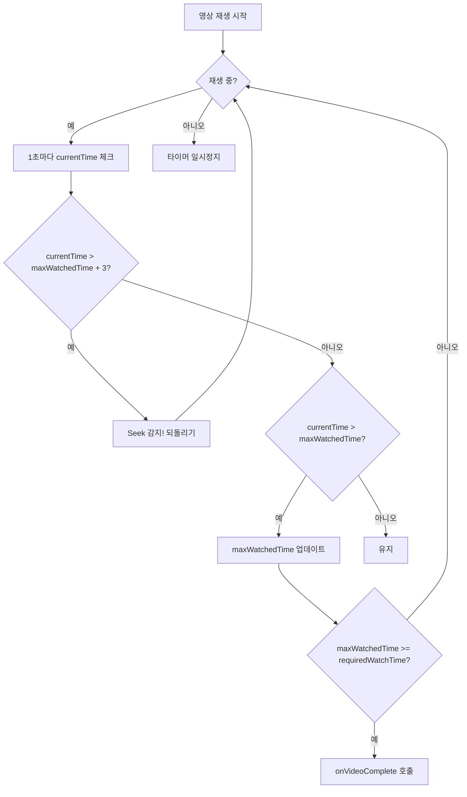

# YouTube 교육 영상 통합 구현 플랜

## 개요
안전 교육 시스템에 YouTube 영상 연결을 지원하며, 빨리감기/넘기기를 방지하고 실제 시청 시간이 경과해야만 퀴즈 버튼이 활성화되는 기능을 구현합니다.

## 주요 요구사항
1. **YouTube 영상 연결** - 로컬 MP4 대신 YouTube URL 지원
2. **빨리감기/넘기기 방지** - 학습자가 영상을 건너뛸 수 없도록 제한
3. **실제 시청 시간 추적** - 일시정지나 탭 이탈 시 시간 카운트 중단
4. **조건부 퀴즈 활성화** - 필수 시청 시간 충족 후에만 "문제 풀기" 버튼 표시

---

## User Review Required

> [!IMPORTANT]
> **YouTube API 키 필요**: YouTube IFrame API 사용 시 특별한 API 키는 필요 없지만, 일부 고급 기능(통계, 분석) 사용 시 Google Cloud Console에서 API 키 발급이 필요할 수 있습니다.

> [!WARNING]
> **YouTube Player 제약사항**: YouTube는 기본적으로 사용자에게 재생 바를 제공합니다. JavaScript로 seek 이벤트를 감지해 되돌릴 수는 있지만, 모바일 기기나 일부 브라우저에서는 완벽한 제어가 어려울 수 있습니다.

---

## Proposed Changes

### 1. 비디오 플레이어 컴포넌트

#### [NEW] [YouTubeEducationPlayer.jsx](file:///d:/Repository/JINSUNG/Life-game/safety-quest-game/src/components/YouTubeEducationPlayer.jsx)

YouTube IFrame API를 활용한 새 교육 전용 플레이어 컴포넌트:

```javascript
// 핵심 기능
- YouTube IFrame API 로드 및 초기화
- 재생 상태 모니터링 (onStateChange)
- 시청 시간 실시간 추적 (setInterval 사용)
- Seek 감지 및 되돌리기 (getCurrentTime vs maxWatchedTime 비교)
- 진행률 표시 및 완료 콜백
```

**주요 Props:**
- `youtubeVideoId`: 단일 YouTube 비디오 ID (예: "dQw4w9WgXcQ") 또는 연속 재생을 위한 비디오 ID 배열 (예: `['GYg7en3Pf88', '7pR4y1SBMb4']`)
- `duration`: 영상 총 길이 (초)
- `requiredWatchTime`: 필수 시청 시간 (초)
- `onTimeUpdate`: 시간 업데이트 콜백
- `onVideoComplete`: 시청 완료 콜백

**다중 영상 연속 재생 로직:**
```javascript
// youtubeVideoId가 배열로 전달될 경우
// 1. 첫 번째 영상(인덱스 0) 재생 완료 시 (onStateChange: YT.PlayerState.ENDED)
// 2. 다음 영상(인덱스 1) 로드 (player.loadVideoById) 및 자동 재생
// 3. 모든 배열의 영상을 차례대로 끝까지 시청해야 onVideoComplete 콜백 호출
```

**빨리감기 방지 로직:**
```javascript
// 1초마다 현재 재생 위치 체크
const checkSeek = () => {
    const currentTime = player.getCurrentTime();
    if (currentTime > maxWatchedTime + 3) {
        // 빨리감기 감지 → 이전 최대 위치로 되돌림
        player.seekTo(maxWatchedTime, true);
        showWarning();
    } else if (currentTime > maxWatchedTime) {
        setMaxWatchedTime(currentTime);
    }
};
```

---

#### [MODIFY] [EducationVideoPlayer.jsx](file:///d:/Repository/JINSUNG/Life-game/safety-quest-game/src/components/EducationVideoPlayer.jsx)

기존 로컬 비디오 플레이어는 그대로 유지하고, Wrapper 컴포넌트 또는 조건부 렌더링으로 YouTube/로컬 비디오 분기 처리 추가:

```jsx
const EducationVideoPlayer = (props) => {
    const isYouTube = props.videoUrl?.includes('youtube') || props.youtubeVideoId;
    
    if (isYouTube) {
        return <YouTubeEducationPlayer {...props} />;
    }
    return <LocalVideoPlayer {...props} />;
};
```

---

### 2. 교육 데이터 스키마 확장

#### [MODIFY] [educationData.js](file:///d:/Repository/JINSUNG/Life-game/safety-quest-game/src/data/educationData.js)

YouTube URL을 저장할 수 있도록 데이터 스키마 확장:

```javascript
{
    id: 'edu_001',
    category: EDUCATION_CATEGORY.FALL_PREVENTION,
    title: '사다리 작업 안전 수칙',
    // 기존 필드
    videoUrl: '/videos/safety/ladder_safety.mp4',  // 로컬 비디오 (fallback)
    // 새 필드
    youtubeVideoId: '3wzOfsyEvow',  // YouTube 비디오 ID (우선 사용)
    // ...
}
```

---

### 3. 페이지 컴포넌트 수정

#### [MODIFY] [EducationPage.jsx](file:///d:/Repository/JINSUNG/Life-game/safety-quest-game/src/pages/EducationPage.jsx)

YouTube 비디오 ID를 플레이어에 전달하도록 수정:

```jsx
<EducationVideoPlayer
    videoUrl={todayEducation.videoUrl}
    youtubeVideoId={todayEducation.youtubeVideoId}  // 추가
    duration={todayEducation.duration}
    requiredWatchTime={todayEducation.requiredWatchTime}
    // ...
/>
```

---

### 4. 퀴즈 데이터 업데이트 (2026-02-11 완료)

#### [UPDATE] [educationData.js](file:///d:/Repository/JINSUNG/Life-game/safety-quest-game/src/data/educationData.js)

모든 교육 항목(edu_001 ~ edu_010)의 퀴즈 데이터를 전면 업데이트했습니다:

- **출처**: `Docs/교육영상_퀴즈.md` (전문적인 안전 교육 퀴즈)
- **형식 변경**: 기존 4지선다 → **5지선다**로 확장
- **문항 수**: 각 교육당 5문항 (총 50문항)
- **구성**:
  - `question`: 문제 지문
  - `options`: 5개 선택지 배열
  - `correctAnswer`: 정답 인덱스 (0~4)
  - `explanation`: 상세 해설 추가

**참고**: `EducationQuizModal.jsx` 컴포넌트는 `options.map()`을 사용하여 선택지를 동적으로 렌더링하므로, 5지선다 변경에 따른 별도의 컴포넌트 수정은 필요하지 않습니다.

---

## 기술 세부사항

### YouTube IFrame API 사용법

```html
<!-- index.html에 스크립트 태그 추가 또는 동적 로드 -->
<script src="https://www.youtube.com/iframe_api"></script>
```

```javascript
// React 컴포넌트에서 동적 로드
useEffect(() => {
    const tag = document.createElement('script');
    tag.src = 'https://www.youtube.com/iframe_api';
    document.body.appendChild(tag);
    
    window.onYouTubeIframeAPIReady = () => {
        // 플레이어 초기화
    };
}, []);
```

### 시청 시간 추적 알고리즘



---

## Verification Plan

### 1. 수동 테스트 (브라우저)

**테스트 환경 설정:**
```bash
cd d:\Repository\JINSUNG\Life-game\safety-quest-game
npm run dev
```

**테스트 시나리오:**

| # | 테스트 항목 | 예상 결과 | 확인 방법 |
|---|------------|----------|----------|
| 1 | YouTube 영상 로드 | 영상이 정상적으로 표시됨 | 교육 페이지 접속 후 영상 확인 |
| 2 | 빨리감기 시도 | 경고 메시지 표시 후 이전 위치로 되돌아감 | 재생 바를 앞으로 드래그 시도 |
| 3 | 되감기 허용 | 이미 시청한 구간으로 되돌아가기 가능 | 재생 바를 뒤로 드래그 |
| 4 | 시청 시간 누적 | 일시정지 시 시간 증가 멈춤 | 재생/일시정지 반복하며 진행률 확인 |
| 5 | 퀴즈 버튼 활성화 | 90% 시청 후에만 "문제 풀기" 버튼 표시 | 영상 끝까지 시청 |
| 6 | 5지선다 퀴즈 표시 | 5개의 선택지가 모두 정상 표시됨 | 퀴즈 모달 열어서 확인 |
| 7 | 탭 이탈 시 처리 | 다른 탭으로 전환 시 시간 카운트 중단 | 영상 재생 중 다른 탭으로 이동 후 복귀 |

### 2. 사용자 확인 요청

> [!NOTE]
> 구현 완료 후, 실제 YouTube 영상 URL/ID를 교육 데이터에 등록하고 교육 페이지에서 테스트해주시기 바랍니다. 모바일 환경에서의 동작도 확인이 필요합니다.

---

## 예상 작업 시간
- YouTubeEducationPlayer.jsx 신규 생성: ~1시간
- 기존 컴포넌트 수정 및 통합: ~30분
- 테스트 및 디버깅: ~30분

---

## 추가 고려사항

1. **오프라인 대비**: YouTube 연결 실패 시 로컬 비디오로 fallback
2. **모바일 호환성**: iOS Safari에서 자동 재생 제한 처리
3. **접근성**: 자막(CC) 활성화 옵션 제공

---

## YouTube 교육 영상 매핑표 (2026-02-09 반영)

> 각 교육 항목에 연결된 YouTube 영상 목록입니다.
> `youtubeVideoId`는 `educationData.js`에 반영되어 있으며, YouTube IFrame API를 통해 재생됩니다.
> 인터넷 연결 불가 시 `videoUrl`(로컬 MP4)로 자동 폴백됩니다.

| 교육 ID | 카테고리 | 교육 제목 | YouTube ID | YouTube 영상 제목 | 채널 | 길이 | 조회수 |
|:-------:|:-------:|----------|:----------:|------------------|------|:----:|------:|
| edu_001 | 추락 예방 | 사다리 작업 안전 수칙 | `3wzOfsyEvow` | [산업안전VR] 사다리 추락! 안전하게 사다리를 설치할 수 있다! | 안전보건공단 | 4:57 | 10만 |
| edu_002 | 추락 예방 | 고소작업대 안전 작업 | `n_uUre9nWQE` | [영상 안전백서] 움직이는 고소작업대 | 삼물가게 / 삼성물산 건설부문 | 4:49 | 9.7천 |
| edu_003 | 추락 예방 | 개구부 및 단차 추락 예방 | `EwfcoDngbSI` | [내 일은 안전 Ep.1] '추락재해'편 | 삼물가게 / 삼성물산 건설부문 | 6:13 | 3만 |
| edu_004 | 끼임 예방 | 기계 작업 끼임 예방 | `sOxSFMUZ8Uk` | 기계 움직이는데 끼임사고, 왜 일어나? KBS 뉴스 | KBS 뉴스 | 9:51 | 2만 |
| edu_005 | 부딪힘 예방 | 지게차 충돌 예방 | `adQHFaQ0S8g` | [VR] 지게차 사례예방 VR안전교육 | 안전보건공단 | 6:03 | 1만 |
| edu_006 | 개인보호구 | 안전모 올바른 착용법 | `3gQpoOe9RWs` | 안전모 미착용, 노무사와 변호사의 이야기 | 사이다안전 | 11:54 | 4천 |
| edu_007 | 개인보호구 | 안전대 착용 및 점검 | `wA_H9Hb_4n4` | 안전대 안전고리 사용 시 유의해야 될 사항 | MINJUN LEE | 5:23 | 2만 |
| edu_008 | 화재 안전 | 소화기 사용법 | `BgJ2p9zdXJk` | [소방안전자료] 소화기 사용법, 정말 제대로 알고 계신가요? | 국립소방연구원 | 4:24 | 3만 |
| edu_009 | 전기 안전 | 전기 안전 기본 | `0UjrtwwaCl4` | [내 일은 안전 Ep.5] '감전 재해'편 | 삼물가게 / 삼성물산 건설부문 | 10:48 | 1만 |
| edu_010 | 밀폐공간 | 밀폐공간 작업 안전 | `fBiwQvg22tk` | (안전교육) 밀폐공간 작업 안전 | KOEN 한국남동발전 | 11:27 | 1.7천 |
| edu_011 | 근로자 권리 | 작업중지권 교육 | `["GYg7en3Pf88", "7pR4y1SBMb4"]` | (다중 영상 연속 재생: 10분 권장 분량 충족 목적) | - | ~10:00 | - |

### 영상 선정 기준
- **YouTube Data API v3** 검색 결과 중 **조회수 1위** 영상을 선정
- 어린이/키즈 대상 콘텐츠는 산업안전 교육 목적에 부적합하여 제외
- 검색 키워드: 각 교육 제목 + "교육" (예: "사다리 작업 안전 수칙 교육")
- 검색 도구: `scripts/youtube_search.py` (Google YouTube Data API v3 기반)

### 영상 교체 방법
1. `scripts/youtube_search.py`를 실행하여 새 영상 검색
   ```bash
   python scripts/youtube_search.py -q "검색 키워드" -n 5
   ```
2. `src/data/educationData.js`에서 해당 교육 항목의 `youtubeVideoId` 값을 변경
3. 본 문서의 매핑표를 함께 업데이트
