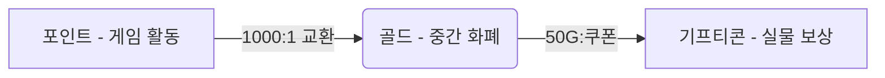

# 보상센터(Reward Center) 통합 구현 문서

이 문서는 포인트 인플레이션 완화 및 사용자 보상 제공을 위해 구현된 **이중 화폐 보상 시스템(포인트 → 골드 → 기프티콘)**의 전체 설계 및 구현 내용을 정리합니다.

---

## 1. 시스템 개요 및 목표

### 배경
- 게임 내 포인트 인플레이션 발생으로 인한 가치 하락 방지
- 사용자들에게 실제 가치가 있는 보상(기프티콘) 제공을 통한 동기 부여
- 한정된 예산(10만원) 내에서 효율적인 보상 운영 필요

### 목표 및 교환 비율
- **목표**: 50명의 사용자에게 2,000원 상당의 커피 쿠폰 제공
- **교환 비율**:
  - **1,000 포인트(P) = 1 골드(G)**
  - **50 골드(G) = 2,000원 커피 쿠폰**
  - 결과적으로 사용자는 **50,000 포인트**를 모아야 쿠폰 1개 획득 가능

---

## 2. 시스템 아키텍처

사용자의 포인트가 직접 실물 보상과 연결되지 않도록 **골드(Gold)**라는 중간 화폐를 도입하여 인플레이션 영향을 격리했습니다.



---

## 3. 백엔드 구현 (Spring Boot)

### 주요 도메인 및 파일 구성
| 도메인 | 역할 | 주요 클래스 |
| :--- | :--- | :--- |
| **Gold** | 골드 잔액 및 내역 관리 | `UserGold`, `GoldTransaction`, `GoldService`, `GoldController` |
| **Reward** | 보상 아이템 및 교환 상태 관리 | `Reward`, `UserReward`, `RewardService`, `RewardController` |
| **Exchange** | 포인트-골드 교환 로직 처리 | `ExchangeService`, `ExchangeController` |

### 주요 API 엔드포인트
- `GET /api/v1/gold/balance`: 현재 골드 잔액 조회
- `GET /api/v1/gold/history`: 골드 획득/차감 내역 조회
- `POST /api/v1/exchange/points-to-gold`: 포인트를 골드로 교환 (1,000P 단위)
- `GET /api/v1/rewards`: 교환 가능한 보상 목록 조회
- `POST /api/v1/rewards/{id}/exchange`: 골드로 보상 교환 신청
- `GET /api/v1/rewards/my-rewards`: 나의 보상 교환 및 쿠폰 발급 내역 조회

---

## 4. 프론트엔드 구현 (React/Vite)

### 주요 컴포넌트 및 API 클라이언트
- **API 클라이언트**: `goldApi.js`, `exchangeApi.js`, `rewardApi.js` (src/api/)
- **신규 페이지**:
  - `Exchange.jsx`: 포인트-골드 교환 인터페이스. 빠른 선택 버튼, 실시간 변환 미리보기 제공.
  - `RewardCenter.jsx`: 보상 상점 및 나의 교환 내역(탭 방식). 재고 부족/골드 부족 상태 표시.
- **UI 통합**:
  - `Shop.jsx`: 상점 상단에 '골드 교환' 및 '보상센터' 연결 버튼 추가
  - `App.jsx`: 새 페이지 라우팅 추가 (`/exchange`, `/reward-center`)

---

## 5. 검증 및 결과

### 자동화 테스트 결과
- **백엔드**: `compileJava` 빌드 검증 완료 ✅
- **프론트엔드**: `vite build` 프로덕션 빌드 검증 완료 ✅
- **라우팅**: 개발 서버 가동 후 `/exchange`, `/reward-center` 경로 HTTP 200 응답 확인 ✅

### 배포 상태
- **GitHub Push**: 백엔드(`master` 브랜치), 프론트엔드(`main` 브랜치) 푸시 완료 🚀

---

## 6. 향후 운영 가이드

### 1) 초기 데이터 세팅 (DB 시드)
시스템 가동 전 `REWARDS` 테이블에 실제 보상 데이터를 입력해야 합니다.
```sql
INSERT INTO rewards (name, description, gold_price, cash_value, type, total_quantity, remaining_quantity, active)
VALUES ('스타벅스 아메리카노', '시원한 아이스 아메리카노 T', 50, 2000, 'COFFEE_COUPON', 50, 50, true);
```

### 2) 쿠폰 발급 프로세스
1. 사용자가 보상센터에서 보상을 교환 신청 (상태: `PENDING`)
2. 관리자가 관리자 도구(또는 DB)에서 쿠폰 번호를 입력하고 상태를 `DELIVERED`로 변경
3. 사용자가 '나의 교환 내역'에서 쿠폰 번호 확인

---
**작성일**: 2026-02-11
**작성자**: Antigravity AI Assistant
